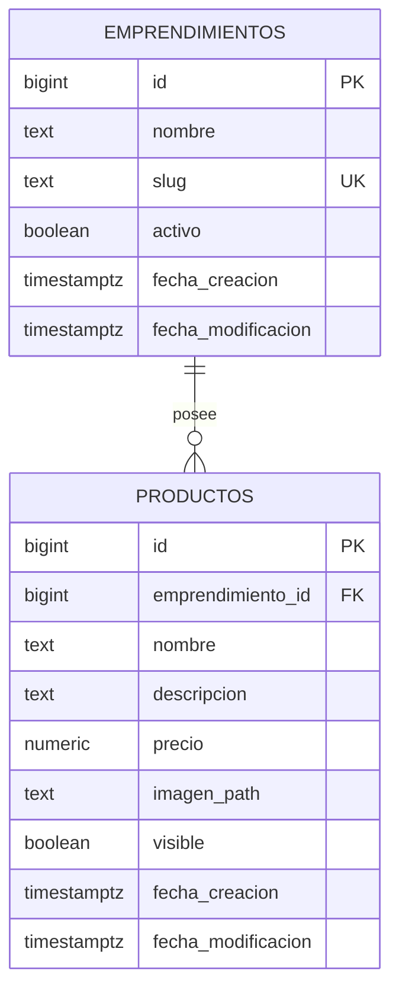

# Modelo de dominio inicial: catálogo y productos

## Información del documento

- Proyecto: EmpreGest
- Repositorio: `2026_TSDS_PP3_EMPREGES_DUGARTE`
- Sprint: Sprint 1
- Tarea de Jira: `ND2026-7 - Diseñar y crear persistencia de productos`
- Estado: Borrador inicial
- Autor: José Dugarte

## 1. Objetivo

Definir el modelo de dominio y la estructura inicial necesaria para almacenar los emprendimientos y sus productos.

El diseño debe permitir que el MVP funcione inicialmente con un único emprendimiento, pero debe quedar preparado para incorporar múltiples emprendimientos sin modificar las entidades fundamentales.

Este documento precede a la creación de las tablas y migraciones en Supabase/PostgreSQL.

## 2. Alcance

Este modelo incluye únicamente:

- Emprendimientos.
- Productos.
- Relación entre emprendimientos y productos.
- Reglas básicas de visibilidad.
- Reglas básicas de integridad.
- Consideraciones iniciales de seguridad.

Quedan fuera de esta tarea:

- Categorías.
- Stock.
- Promociones.
- Clientes.
- Carrito de compra.
- Pedidos y detalles de pedido.
- Pagos.
- Fidelización.
- Repartos.
- Estadísticas.
- Roles y permisos definitivos de usuarios.

Estas funcionalidades se incorporarán cuando sean necesarias para las historias correspondientes.

## 3. Entidad Emprendimiento

Representa al negocio gastronómico que utiliza EmpreGest.

Aunque el MVP comience con un único negocio, esta entidad permite identificar a qué emprendimiento pertenece cada producto.

| Atributo | Tipo previsto | Obligatorio | Descripción |
|---|---|---:|---|
| `id` | `bigint` | Sí | Identificador único generado por el sistema. |
| `nombre` | `text` | Sí | Nombre comercial del emprendimiento. |
| `slug` | `text` | Sí | Identificador legible utilizado para localizar públicamente al emprendimiento. |
| `activo` | `boolean` | Sí | Indica si el emprendimiento se encuentra activo. |
| `fecha_creacion` | `timestamptz` | Sí | Fecha y hora de creación del registro. |
| `fecha_modificacion` | `timestamptz` | Sí | Fecha y hora de la última modificación. |

### Ejemplo

```text
id: 1
nombre: Tequeños Gavidia
slug: tequenos-gavidia
activo: true
```

El `slug` podría utilizarse posteriormente en una dirección como:

```text
empregest.com/tequenos-gavidia
```

## 4. Entidad Producto

Representa un producto ofrecido por un emprendimiento dentro de su catálogo.

| Atributo | Tipo previsto | Obligatorio | Descripción |
|---|---|---:|---|
| `id` | `bigint` | Sí | Identificador único generado por el sistema. |
| `emprendimiento_id` | `bigint` | Sí | Identifica al emprendimiento propietario del producto. |
| `nombre` | `text` | Sí | Nombre comercial mostrado en el catálogo. |
| `descripcion` | `text` | No | Información adicional sobre el producto. |
| `precio` | `numeric(12,2)` | Sí | Precio vigente del producto. |
| `imagen_path` | `text` | No | Ruta de la imagen almacenada en Supabase Storage. |
| `visible` | `boolean` | Sí | Indica si el producto aparece en el catálogo público. |
| `fecha_creacion` | `timestamptz` | Sí | Fecha y hora de creación del registro. |
| `fecha_modificacion` | `timestamptz` | Sí | Fecha y hora de la última modificación. |

### Ejemplo

```text
id: 1
emprendimiento_id: 1
nombre: 24 Minis de Queso
descripcion: Porción de 24 tequeños pequeños rellenos de queso
precio: 18000.00
imagen_path: productos/24-minis-queso.webp
visible: true
```

La base de datos almacenará la ruta de la imagen y no el archivo directamente. El archivo será administrado mediante Supabase Storage.

## 5. Relación entre entidades

Un emprendimiento puede tener cero, uno o muchos productos.

Cada producto debe pertenecer exactamente a un emprendimiento.



### Cardinalidad

```text
EMPRENDIMIENTO 1 ───────── 0..N PRODUCTOS
```

Esto significa:

- Un emprendimiento puede existir aunque todavía no haya registrado productos.
- Un emprendimiento puede registrar muchos productos.
- Un producto no puede existir sin un emprendimiento.
- Un producto no puede pertenecer simultáneamente a dos emprendimientos.

## 6. Reglas de negocio

| Código | Regla |
|---|---|
| RN-P01 | Todo producto pertenece a un único emprendimiento. |
| RN-P02 | El nombre del emprendimiento es obligatorio. |
| RN-P03 | El `slug` del emprendimiento es obligatorio y único. |
| RN-P04 | El nombre del producto es obligatorio y no puede contener solamente espacios. |
| RN-P05 | El precio del producto es obligatorio y debe ser mayor que cero. |
| RN-P06 | La descripción y la imagen del producto son opcionales. |
| RN-P07 | Todo producto nuevo comienza visible de forma predeterminada. |
| RN-P08 | Un producto oculto permanece almacenado, pero no aparece en el catálogo público. |
| RN-P09 | Durante el flujo normal, los productos se ocultan en lugar de eliminarse físicamente. |
| RN-P10 | El catálogo público muestra únicamente productos visibles pertenecientes al emprendimiento consultado. |
| RN-P11 | Dos emprendimientos diferentes pueden registrar productos con el mismo nombre. |
| RN-P12 | Un mismo emprendimiento no puede registrar dos productos con el mismo nombre. |
| RN-P13 | Un emprendimiento no puede eliminarse mientras tenga productos asociados. |

## 7. Decisiones técnicas

### Identificadores

Se utilizarán identificadores numéricos generados automáticamente por PostgreSQL mediante `bigint identity`.

EmpreGest utiliza una única base de datos centralizada, por lo que no necesita identificadores distribuidos en esta etapa.

### Precios

Los precios se almacenarán con un tipo decimal exacto, previsto como `numeric(12,2)`.

No se utilizarán tipos de punto flotante porque pueden introducir errores de precisión en cálculos monetarios.

### Fechas

Las fechas se almacenarán contemplando la zona horaria mediante `timestamptz`.

### Convención de nombres

Las tablas y columnas utilizarán:

- Minúsculas.
- Palabras en español.
- Formato `snake_case`.
- Nombres en plural para las tablas.

Ejemplos:

```text
emprendimientos
productos
emprendimiento_id
fecha_creacion
```

### Clave foránea

`productos.emprendimiento_id` será una clave foránea que referenciará a `emprendimientos.id`.

La columna será indexada porque PostgreSQL no crea automáticamente índices para las claves foráneas.

### Integridad referencial

La eliminación de un emprendimiento que tenga productos asociados será restringida.

Los productos históricos no deben desaparecer accidentalmente como consecuencia de eliminar un emprendimiento.

## 8. Seguridad inicial

Las tablas se crearán en el esquema `public` de Supabase con Row Level Security habilitado.

Las reglas iniciales serán:

- Los visitantes podrán consultar únicamente emprendimientos activos.
- Los visitantes podrán consultar únicamente productos visibles.
- No se permitirán escrituras públicas anónimas.
- Las operaciones de creación y modificación requerirán posteriormente un usuario autenticado relacionado con el emprendimiento.
- La clave privilegiada de Supabase nunca será incluida en el frontend de React.

Las políticas definitivas de administración se implementarán cuando se modele la relación entre usuarios y emprendimientos.

## 9. Evolución prevista

En tareas posteriores, el modelo será ampliado con:

- Pedidos.
- Detalles de pedido.
- Clientes.
- Usuarios y roles.
- Stock.
- Categorías.
- Promociones.
- Fidelización.

La futura incorporación de estas entidades no debería exigir modificar la relación fundamental entre `emprendimientos` y `productos`.

## 10. Criterio de finalización del diseño

El diseño se considerará listo para implementar cuando:

- Las entidades estén definidas.
- Los atributos obligatorios y opcionales estén identificados.
- Las reglas de negocio estén documentadas.
- La cardinalidad esté establecida.
- Las decisiones técnicas puedan justificarse.
- El modelo pueda traducirse a una migración PostgreSQL sin ambigüedades.